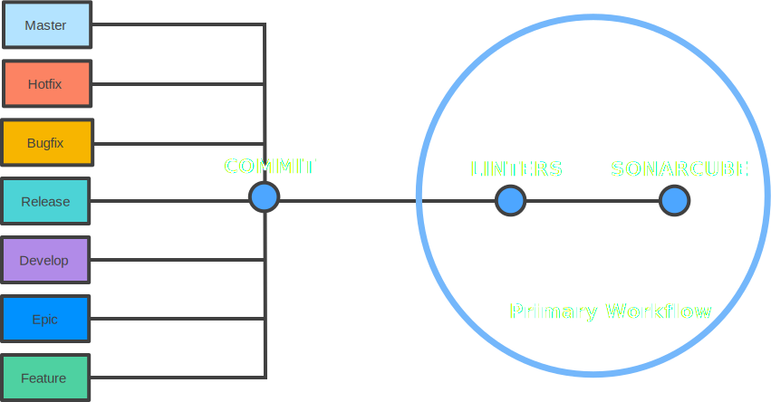
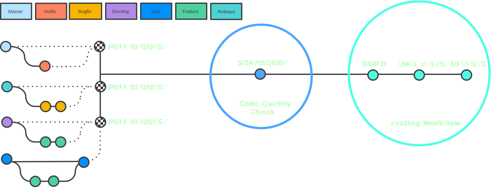
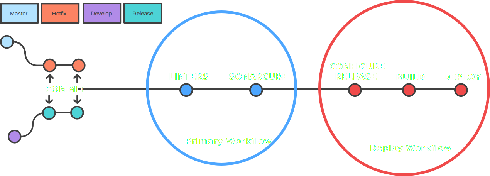
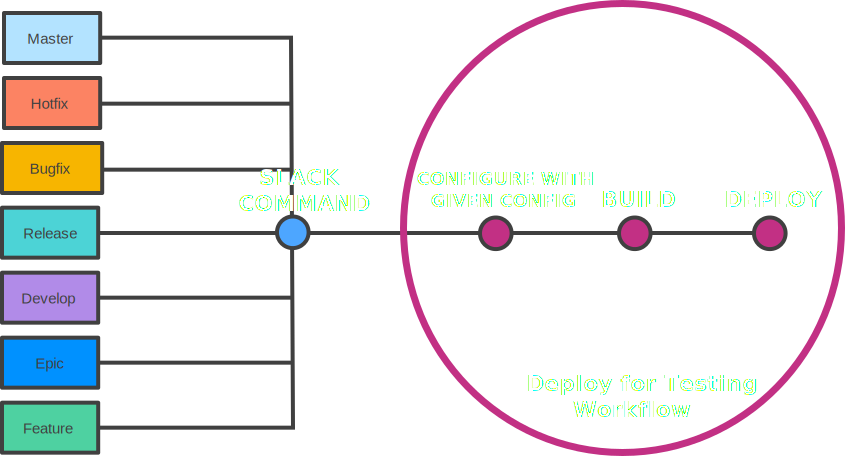

# Mobillium CI/CD Workflows

### Table of Contents

1. [Primary Workflow](#primary)
1. [Testing Workflow](#testing)
1. [Deploy Workflow](#release-bugfix)
1. [Deploy For Testing Workflow](#hotfix)

## Primary Workflow

Primary workflow trigger when developer pushes a commit to all branches. In this workflow we are analyzing the code base from the perspective of code quality & code security. We are checking the code base with linters & 3rd party tools for maintaining code base. Primary workflow always runs before the all workflows.

## Testing Workflow

Testing workflow triggers in two ways. First one is when developer opens a pull request to develop branch from feature or epic branch, second one is when developer opens a pull request to master branch from hotfix branch. In this workflow we are running Unit & UI tests. Before this workflow, [Primary Workflow](#primary) runs.  If tests fail or primary workflow fails pull requests can't be merged.

## Deploy Workflow

Deploy workflow triggers in two ways. First one is when developers pushes a commit to release branch, second one is when developer pushes a commit to hotfix branch. In this workflow we are configuring the app with release config, build & deploy to stores. Before this workflow, [Primary Workflow](#primary) runs.

## Deploy For Testing Workflow

Deploy for testing workflow actually more than one workflow. It changes depends on configuration. For example if app has develop & release configuration then this app has two deploy for testing workflow one of them is for develop config the other one is for release config, both workflows need a version code for work properly. Deploy For Testing workflow triggered through Slack Commands. Version number must be given to Slack Command. Slack pass this parameter to CI/CD system and the system will config code base with given configuration with given version number and deploy it to the testing platforms. Before this workflow, [Primary Workflow](#primary) runs.

